# 🏗️ AI SIEM - Architektura Zunifikowana

## 📋 Spis Treści

1. [Przegląd Architektury](#przegląd-architektury)
2. [Warstwa Aplikacji (Application Layer)](#warstwa-aplikacji-application-layer)
3. [Warstwa Kolekcji (Collection Layer - MPC Server)](#warstwa-kolekcji-collection-layer---mpc-server)
4. [Warstwa Przetwarzania (Processing Layer)](#warstwa-przetwarzania-processing-layer)
5. [Warstwa Monitoringu (SIEM Monitoring Layer)](#warstwa-monitoringu-siem-monitoring-layer)
6. [Kontrakt JSON-RPC](#kontrakt-json-rpc)
7. [Bezpieczeństwo i PII Handling](#bezpieczeństwo-i-pii-handling)
8. [Inteligentny Routing](#inteligentny-routing)
9. [Przykłady Użycia](#przykłady-użycia)

---

## Przegląd Architektury

AI SIEM oferuje **dwa tryby działania** z **wspólnym systemem monitoringu**:

### 🎯 Deployment Modes

#### Mode 1: Direct Monitoring (Passive)
```
Application → Direct API → LLM Provider
                   ↓
            SIEM Collectors (intercept)
                   ↓
            Monitoring Pipeline
```
**Use case:** Monitor existing apps without code changes

#### Mode 2: MPC Gateway (Active)
```
Application → MPCClient → MPC Server → Routing → Backend
                             ↓
                      SIEM Monitoring (embedded)
                             ↓
                      Monitoring Pipeline
```
**Use case:** New apps requiring control, routing, optimization

### 🏗️ Architektura Zunifikowana (4-warstwowa)

AI SIEM wykorzystuje architekturę 4-warstwową zaprojektowaną dla:
- **Skalowalności** - każda warstwa może być skalowana niezależnie
- **Bezpieczeństwa** - MPC Server + SIEM zapewniają kompleksową ochronę
- **Elastyczności** - łatwa wymiana modeli i backendów bez wpływu na aplikacje
- **Observability** - pełna widoczność wszystkich operacji

```mermaid
flowchart TB
    subgraph Application["🎯 Layer 1: Application Layer (Clients)"]
        App1[Web App]
        App2[Mobile App]
        App3[Service/API]
        App4[CLI Tool]
    end

    subgraph Collection["🔒 Layer 2: Collection Layer (MPC Server - Optional)"]
        MPC[MPC Server]

        subgraph MPCComponents["MPC Components"]
            Validator[Request Validator]
            Auth[Authentication]
            PIIDetection[PII Detection]
            Router[Intelligent Router]
            AuditLog[Audit Logger]
        end
    end

    subgraph Processing["⚙️ Layer 3: Processing Layer"]
        subgraph Backends["Processing Backends"]
            LLM_Large[LLM Large<br/>GPT-4, Claude Opus]
            LLM_Small[LLM Small<br/>Local Models]
            Rules[Rule Engine<br/>Regex, Classifiers]
            Hybrid[Hybrid<br/>Rules + LLM]
        end
    end

    subgraph Monitoring["🔍 Layer 4: SIEM Monitoring Layer (Cross-cutting)"]
        subgraph SIEMComponents["SIEM Components"]
            Collectors[Collectors<br/>API Interception]
            EventProcessor[EventProcessor<br/>Security Analysis]
            AnomalyDetector[AnomalyDetector<br/>Threat Detection]
            EventStorage[EventStorage<br/>SQLite Database]
            CLIDashboard[CLI Dashboard<br/>Visualization]
        end
    end

    %% Direct Mode Flow
    App1 & App2 & App3 & App4 -.->|Direct Mode| LLM_Large & LLM_Small

    %% MPC Gateway Mode Flow
    App1 & App2 & App3 & App4 -->|Gateway Mode<br/>via MPCClient| MPC
    MPC --> Validator --> Auth --> PIIDetection --> Router --> AuditLog
    Router --> LLM_Large & LLM_Small & Rules & Hybrid

    %% SIEM Monitoring (both modes)
    LLM_Large & LLM_Small & Rules & Hybrid --> Collectors
    Collectors --> EventProcessor --> AnomalyDetector --> EventStorage --> CLIDashboard

    style Application fill:#e1f5ff
    style Collection fill:#fff3e0
    style Processing fill:#e8f5e9
    style Monitoring fill:#fce4ec
```



### Podział Odpowiedzialności

| Warstwa | Odpowiedzialność | Nie Robi |
|---------|-----------------|-----------|
| **Application** | Zbiera kontekst, buduje prompty, wysyła zapytania | Nie przetwarza danych, nie wykonuje analizy |
| **Collection (MPC)** | Normalizuje, waliduje, routuje, autoryzuje, audytuje | Nie przetwarza treści, tylko kontroluje przepływ |
| **Processing** | Wykonuje faktyczne przetwarzanie, analizy, scoring | Nie decyduje o routingu, nie zarządza dostępem |
| **SIEM Monitoring** | Monitoruje wszystkie operacje, wykrywa zagrożenia, agreguje metryki | Nie blokuje requestów (tylko alerty), nie modyfikuje danych |

### Integracja Warstw

**Direct Monitoring Mode:**
```
Application → Processing → SIEM Monitoring
```
- Application wywołuje bezpośrednio API
- SIEM Collectors przechwytują wywołania (passive interception)
- Monitoring odbywa się post-factum

**MPC Gateway Mode:**
```
Application → Collection (MPC) → Processing → SIEM Monitoring
```
- Application używa MPCClient
- MPC Server kontroluje i routuje przed wykonaniem
- SIEM Monitoring działa jako embedded component w MPC
- Monitoring odbywa się real-time (pre + post execution)

---

## Warstwa Aplikacji (Application Layer)

### Opis

Warstwa aplikacji to **osobny klient / osobna usługa / osobny endpoint LLM**, który:
- Zbiera kontekst użytkownika
- Buduje prompty i zapytania
- Generuje żądania do MPC Server
- **NIE** wykonuje przetwarzania danych

### Komponenty

```
application/
├── client.py          # MPCClient - główny klient
├── example_usage.py   # Przykłady użycia
└── __init__.py
```

### MPCClient - Główny Klient

```python
from application.client import MPCClient
from schemas.contracts import SensitivityLevel, ProcessingHint

client = MPCClient(
    application_id="my-app",
    auth_token="your-token",
    environment="prod"
)

# Wysłanie zapytania
result = await client.process(
    prompt="Analyze this security log",
    sensitivity=SensitivityLevel.INTERNAL,
    processing_hint=ProcessingHint.AUTO
)

print(result['response'])
```

### SimpleMPCClient - Uproszczony Klient

```python
from application.client import SimpleMPCClient

client = SimpleMPCClient(auth_token="token")

# Proste zapytanie
response = await client.ask("What is API security?")

# Zapytanie z PII
response = await client.ask_secure(
    "My email is user@example.com",
    contains_pii=True
)
```

### Kluczowe Funkcje

1. **Budowanie Kontraktu** - konwertuje zapytania użytkownika na MPCRequest
2. **Komunikacja** - wysyła zapytania do MPC Server (HTTP/gRPC)
3. **Obsługa Odpowiedzi** - parsuje MPCResponse i zwraca wyniki
4. **Error Handling** - obsługuje błędy i retry

---

## Warstwa Kolekcji (Collection Layer - MPC Server)

### Opis

**MPC (Multi-Provider Coordinator) Server** pełni rolę pośrednika komunikacyjnego, który:
- Odbiera dane z Application Layer
- Normalizuje i waliduje zapytania
- Kontroluje przepływ danych
- Pilnuje autoryzacji i polityki dostępu
- Routuje do odpowiednich backendów
- **NIE** przetwarza danych, tylko koordynuje i kolekcjonuje

### Komponenty

```
mpc_server/
├── server.py          # Główny serwer MPC
├── router.py          # Inteligentny system routingu
└── __init__.py
```

### Pipeline Przetwarzania


### Funkcje MPC Server

#### 1. Walidacja Schematu

```python
# Waliduje payload zgodnie z zarejestrowanym schematem
validated_payload = validate_payload(
    request.payload_schema,  # "llm.request.v1"
    request.payload
)
```

#### 2. Uwierzytelnianie i Autoryzacja

```python
# JWT token verification
principal = access_control.authenticate(request.auth.token)

# RBAC/ABAC authorization
is_authorized, reason = access_control.authorize(
    principal,
    action="process",
    resource_attributes={
        'sensitivity': request.config.sensitivity,
        'estimated_cost': 0.01
    }
)
```

#### 3. Wykrywanie PII

```python
# Detekcja PII w promptach
pii_result = pii_detector.detect(prompt_text)

if pii_result.has_pii:
    # Blokuj lub routuj do bezpiecznego backendu
    should_block, reason = pii_router.should_block(
        prompt_text,
        target_backend
    )
```

#### 4. Inteligentny Routing

```python
# Wybór odpowiedniego backendu
routing_decision = router.route(
    capability=CapabilityType.TEXT_GENERATION,
    sensitivity=SensitivityLevel.INTERNAL,
    processing_hint=ProcessingHint.AUTO,
    max_cost=1.0,
    max_latency_ms=5000,
    use_cascade=True
)
```

#### 5. Audit Logging

```python
# Logowanie wszystkich operacji (bez PII!)
audit.log_request(
    request_id=request_id,
    client_id=hash(client_id),  # Zahashowane
    action="process",
    sensitivity=sensitivity,
    outcome=Outcome.SUCCESS
)
```

---

## Warstwa Przetwarzania (Processing Layer)

### Opis

Warstwa przetwarzania to miejsce, gdzie odbywa się **faktyczne przetwarzanie danych**:
- Scoring i analizy
- Inferencje na modelach
- Routing do systemów
- Klasyczne algorytmy (regex, reguły)

### Komponenty

```
processing/
├── backends.py        # Implementacje backendów
├── __init__.py
└── (istniejące: analyzer.py, processor.py)
```

### Typy Backendów

#### 1. LLM Backends

```python
# OpenAI
backend = OpenAIBackend(
    backend_id="openai:gpt-4",
    api_key=api_key,
    model="gpt-4"
)

# Ollama (local)
backend = OllamaBackend(
    backend_id="ollama:llama2",
    base_url="http://localhost:11434",
    model="llama2"
)
```

#### 2. Rule-Based Backends

```python
# Deterministyczne reguły
backend = RuleBasedBackend(
    backend_id="rules:classifier"
)

# Szybkie, tanie, przewidywalne
result = await backend.process("Error: timeout")
# Result: "Classification: ERROR_LOG"
```

#### 3. Hybrid Backends

```python
# Kombinacja: reguły → LLM (jeśli confidence < threshold)
hybrid = HybridBackend(
    backend_id="hybrid:rule-llm",
    rule_backend=RuleBasedBackend(),
    llm_backend=OllamaBackend(),
    confidence_threshold=0.8
)

# Próbuje najpierw reguł (szybko/tanio)
# Jeśli confidence < 0.8 → fallback do LLM
```

### Backend Registry

```python
from processing.backends import get_backend_registry, initialize_default_backends

# Inicjalizacja
initialize_default_backends(
    openai_api_key=os.getenv("OPENAI_API_KEY"),
    ollama_url="http://localhost:11434"
)

# Użycie
registry = get_backend_registry()
backend = registry.get("openai:gpt-3.5-turbo")

result = await backend.process(
    prompt="Analyze this",
    params={"temperature": 0.7}
)
```

---

## Warstwa Monitoringu (SIEM Monitoring Layer)

### Opis

Warstwa SIEM Monitoring to **cross-cutting concern** działający w obu trybach:
- **Direct Mode**: Passive interception - przechwytuje wywołania API po fakcie
- **MPC Gateway Mode**: Embedded monitoring - wbudowany w pipeline MPC Server

**Główne funkcje:**
- 🔍 Pełna observability wszystkich requestów/responses
- 🔒 Wykrywanie zagrożeń bezpieczeństwa (PII, prompt injection)
- 📊 Agregacja metryk i statystyk
- 🚨 Real-time anomaly detection
- 💾 Persystencja i audyting
- 📈 Wizualizacja w CLI Dashboard

### Komponenty

```
siem/
├── collector.py         # OpenAI, Anthropic, Gemini collectors
├── local_collector.py   # Ollama, LM Studio, LocalAI collectors
├── processor.py         # EventProcessor - security analysis
├── analyzer.py          # AnomalyDetector - threat detection
├── storage.py           # EventStorage - SQLite persistence
├── cli.py               # CLI Dashboard - visualization
└── models.py            # AIEvent, Anomaly data models
```

### Architektura SIEM


### Główne Funkcje SIEM

#### 1. Event Collection

**Direct Mode:**
```python
from collector import OpenAICollector
from openai import OpenAI

client = OpenAI()
collector = OpenAICollector(client, event_handler=handle_event)

# Wywołania są automatycznie przechwytywane
response = collector.client.chat.completions.create(
    model="gpt-4",
    messages=[{"role": "user", "content": "Hello"}]
)
# → AIEvent emitted automatically
```

**MPC Gateway Mode:**
```python
# SIEM jest wbudowany w MPC Server
# Każde przejście przez MPC automatycznie generuje event
mpc_response = await mpc_server.process(mpc_request)
# → AIEvent emitted + stored
```

#### 2. Security Analysis

**PII Detection:**
```python
from processor import EventProcessor

processor = EventProcessor()
event = processor.process_event(raw_event)

if event.has_pii:
    print(f"⚠️ PII detected: {event.pii_types}")
    # → ['email', 'phone']
```

**Prompt Injection Detection:**
```python
if event.injection_detected:
    print(f"🚨 CRITICAL: Prompt injection detected!")
    # → Risk level automatically set to CRITICAL
```

**Risk Scoring:**
```python
# Automatic risk calculation based on:
# - Failed request: +3
# - Injection detected: +4
# - PII present: +2
# - High latency: +1
# - High cost: +2

if event.risk_level == "CRITICAL":
    # Immediate alert
    send_alert(event)
```

#### 3. Anomaly Detection

**Cost Anomalies:**
```python
from analyzer import AnomalyDetector

detector = AnomalyDetector()
anomalies = detector.analyze_event(event, historical_events)

for anomaly in anomalies:
    if anomaly.anomaly_type == "cost_spike":
        print(f"💰 Cost spike: ${event.cost_usd} (3x average)")
```

**Pattern Analysis:**
```python
# High request rate
if detector.detect_high_request_rate(events, window_minutes=5):
    # → Create anomaly: high_request_rate

# Error rate spike
if detector.detect_error_rate(events) > 0.1:
    # → Create anomaly: high_error_rate (CRITICAL)
```

#### 4. Storage & Persistence

**Event Storage:**
```python
from storage import EventStorage

storage = EventStorage("ai_monitoring.db")

# Store event
storage.store_event(event)

# Store anomalies
for anomaly in anomalies:
    storage.store_anomaly(anomaly)

# Query
recent_events = storage.get_recent_events(limit=100)
critical_anomalies = storage.get_anomalies_by_severity("CRITICAL")
```

**Indexed Queries:**
```sql
-- Automatic indexes for fast queries
CREATE INDEX idx_events_timestamp ON events(timestamp);
CREATE INDEX idx_events_provider ON events(provider);
CREATE INDEX idx_events_risk_level ON events(risk_level);
CREATE INDEX idx_anomalies_severity ON anomalies(severity);
```

#### 5. Visualization & Alerts

**CLI Dashboard:**
```python
from cli import display_dashboard

# Real-time dashboard with:
# - Summary statistics
# - Recent events
# - Active anomalies
# - Cost breakdown
# - Performance metrics
display_dashboard()
```

**Real-time Alerts:**
```python
# Automatic console alerts for:
# - CRITICAL security threats (prompt injection)
# - HIGH cost anomalies (>$0.50/request)
# - HIGH error rates (>10%)
# - PII detections

🚨 CRITICAL ALERT: Prompt injection detected in request req-123
💰 HIGH ALERT: Cost spike detected: $1.23 (3x average)
⚠️ PII detected: email, phone in request req-456
```

### SIEM Data Model

#### AIEvent Schema

```python
@dataclass
class AIEvent:
    request_id: str
    timestamp: datetime
    user_id: str

    # Provider & Model
    provider: str  # "openai", "anthropic", "ollama"
    model: str     # "gpt-4", "claude-3", "llama2"

    # Request/Response
    prompt: str
    response: str
    system_prompt: Optional[str]

    # Metrics
    latency_ms: float
    prompt_tokens: int
    completion_tokens: int
    total_tokens: int
    cost_usd: float

    # Status
    success: bool
    error_message: Optional[str]

    # Security Flags
    has_pii: bool
    pii_types: List[str]
    injection_detected: bool
    risk_level: str  # "LOW", "MEDIUM", "HIGH", "CRITICAL"

    # Metadata
    metadata: Dict[str, Any]
```

#### Anomaly Schema

```python
@dataclass
class Anomaly:
    anomaly_id: str
    event_id: str
    timestamp: datetime

    # Classification
    anomaly_type: str  # "cost_spike", "high_latency", "prompt_injection"
    severity: str      # "MEDIUM", "HIGH", "CRITICAL"

    # Details
    description: str
    details: Dict[str, Any]

    # Recommended Action
    recommended_action: str
```

### Integration z MPC Server

**Embedded Monitoring w MPC:**

```python
from mpc_server.server import MPCServer
from siem.collector import SIEMCollector

# MPC Server z wbudowanym SIEM
mpc_server = MPCServer(
    enable_siem_monitoring=True,
    siem_collector=SIEMCollector()
)

# Pipeline MPC z SIEM:
# 1. Request validation
# 2. Authentication & Authorization
# 3. PII detection (pre-execution)
# 4. Routing decision
# 5. Backend processing
# 6. SIEM event emission ← tutaj
# 7. Anomaly detection
# 8. Storage
# 9. Real-time alerts
# 10. Response return
```

**Dual Data Collection:**


### Monitoring Metrics

**Tracked Metrics:**

| Kategoria | Metryki | Progi Alertów |
|-----------|---------|---------------|
| **Cost** | Total cost, cost per request, cost per provider | > $0.50/request (HIGH) |
| **Performance** | Latency, tokens/sec, throughput | > 5000ms (MEDIUM) |
| **Security** | PII detections, injection attempts, risk scores | Injection = CRITICAL |
| **Reliability** | Success rate, error rate, availability | Error rate > 10% (CRITICAL) |
| **Usage** | Request count, token usage, active users | > 50 req/min (MEDIUM) |

**Aggregations:**

```python
# Time-based statistics
stats = storage.get_statistics(hours=24)

print(f"Total requests: {stats['total_requests']}")
print(f"Success rate: {stats['success_rate']:.2%}")
print(f"Total cost: ${stats['total_cost']:.2f}")
print(f"Avg latency: {stats['avg_latency_ms']:.0f}ms")
print(f"PII detections: {stats['pii_count']}")
print(f"Anomalies: {stats['anomaly_count']}")
```

### Benefits of Integrated SIEM

✅ **Comprehensive Visibility** - Every request monitored, no blind spots
✅ **Pre + Post Execution** - Security checks before and after processing
✅ **Cost Optimization** - Track costs in real-time, detect anomalies early
✅ **Threat Detection** - PII, injection, suspicious patterns
✅ **Audit Trail** - Complete history in SQLite
✅ **Real-time Alerts** - Immediate notification of critical issues
✅ **Performance Insights** - Latency, throughput, error tracking
✅ **Compliance** - Data retention, PII handling, audit logs

---

## Kontrakt JSON-RPC

### Podstawowa Zasada Kontraktu

✅ **Schema-first** - wszystkie zapytania/odpowiedzi zgodne ze schematem
✅ **Wersjonowanie** - `mpc_version`, `payload_schema`
✅ **Stateless** - każde zapytanie kompletne i samoopisowe
✅ **Idempotentność** - `request_id`, `idempotency_key`

### Request Schema

```python
{
  "mpc_version": "1.0",
  "request_id": "uuid-v4",
  "idempotency_key": "optional-key",
  "timestamp": "2025-11-14T12:34:56Z",

  "source": {
    "application_id": "app-order-service",
    "environment": "prod",
    "version": "1.2.3"
  },

  "type": "process_request",
  "payload_schema": "llm.request.v1",
  "payload": {
    "model": "gpt-4",
    "prompt": "Analyze this security log",
    "max_tokens": 1000
  },

  "config": {
    "sensitivity": "internal",
    "processing_hint": "auto",
    "return_route": "sync",
    "timeout_ms": 30000,
    "enable_pii_detection": true,
    "enable_injection_detection": true
  },

  "auth": {
    "token": "jwt-bearer-token",
    "signature": "hmac-sha256-signature"
  }
}
```

### Response Schema

```python
{
  "mpc_version": "1.0",
  "request_id": "uuid-v4",
  "response_id": "uuid-v4",
  "timestamp": "2025-11-14T12:34:57Z",

  "status": "ok",  # ok | error | queued | processing

  "result": {
    "response": "Analysis complete...",
    "tokens": 156
  },

  "processing": {
    "backend": "openai:gpt-4",
    "latency_ms": 1234.5,
    "cost_usd": 0.0023,
    "confidence": 0.95,
    "fallback_used": false
  },

  "security_flags": {
    "has_pii": false,
    "injection_detected": false
  }
}
```

### Poziomy Wrażliwości (Sensitivity)

| Poziom | Opis | Dozwolone Backendy |
|--------|------|-------------------|
| `public` | Dane publiczne | Wszystkie |
| `internal` | Dane wewnętrzne | Wszystkie z wyjątkiem publicznych API |
| `sensitive` | Dane wrażliwe | Tylko zaufane backendy |
| `pii` | Dane osobowe | Tylko on-prem / prywatne modele |
| `confidential` | Dane poufne | Tylko on-prem z szyfrowaniem |

---

## Bezpieczeństwo i PII Handling

### Kluczowe Zasady

1. **Minimalizacja Danych** - przesyłaj tylko to, co konieczne
2. **Tagowanie Wrażliwości** - każde payload ma `sensitivity`
3. **Encryption in Transit** - TLS 1.3 między wszystkimi hopami
4. **Short-lived Credentials** - JWT z krótkim TTL (15 min)
5. **Key Management** - sekrety z KMS (nie hardcoded!)
6. **Redaction & Tokenization** - maskuj/tokenizuj PII przed wysłaniem
7. **PII-aware Routing** - dane z PII tylko do zatwierdzonych backendów
8. **Data Retention** - automatyczne usuwanie po TTL
9. **Audit Logs** - structured logs bez PII w payloadach
10. **Least Privilege** - RBAC/ABAC dla każdego zapytania

### PII Detection

```python
from security.pii_handler import PIIDetector

detector = PIIDetector()
result = detector.detect("My email is john@example.com and phone is 555-1234")

print(result.has_pii)  # True
print(result.pii_types)  # [PIIType.EMAIL, PIIType.PHONE]
print(result.matches)  # [PIIMatch(...), PIIMatch(...)]
```

### PII Redaction

```python
from security.pii_handler import PIIRedactor

# Strategia: REDACT | MASK | HASH | TOKENIZE
redactor = PIIRedactor(strategy="TOKENIZE")

text = "Contact me at john@example.com"
redacted, result = redactor.redact(text)

print(redacted)  # "Contact me at TOKEN_abc123def456"

# Odwrócenie tokenizacji
original = redactor.detokenize(redacted)
print(original)  # "Contact me at john@example.com"
```

### PII-aware Routing

```python
from security.pii_handler import PIIRouter

router = PIIRouter(config={
    'routing_rules': {
        'no_pii': ['public_model', 'cloud_model'],
        'has_pii': ['private_model', 'on_prem_model'],
        'sensitive_pii': ['on_prem_model_encrypted']
    }
})

# Sprawdź dozwolone backendy
allowed = router.get_allowed_backends(
    text="Process my data",
    sensitivity="internal"
)

# Sprawdź czy zablokować
should_block, reason = router.should_block(
    text="My SSN is 123-45-6789",
    backend="openai:gpt-4"
)
# (True, "Backend not allowed for sensitive PII")
```

### Authentication & Authorization

```python
from security.auth import AccessControl, Permission, Role

# Inicjalizacja
access_control = AccessControl(
    jwt_secret="from-kms",
    hmac_secret="from-kms"
)

# Utworzenie tokenu
token = access_control.create_service_token(
    service_name="analytics-service",
    permissions=[Permission.READ, Permission.EXECUTE, Permission.PII_ACCESS]
)

# Uwierzytelnienie
principal = access_control.authenticate(token)

# Autoryzacja
is_authorized, reason = access_control.authorize(
    principal,
    action="process",
    resource_attributes={
        'sensitivity': 'pii',
        'estimated_cost': 0.5
    }
)
```

### Audit Logging

```python
from security.audit import AuditLogger, Outcome

audit = AuditLogger(log_file="audit.log")

# Logowanie zapytania (bez PII!)
audit.log_request(
    request_id="req-123",
    client_id=hash("user@example.com"),  # Zahashowane!
    action="process",
    sensitivity="internal",
    outcome=Outcome.SUCCESS
)

# Logowanie PII detection
audit.log_pii_detection(
    request_id="req-123",
    pii_types=["email", "phone"],
    action_taken="routed_to_private_model"
)

# Logowanie security violation
audit.log_security_violation(
    request_id="req-123",
    violation_type="prompt_injection",
    details={'pattern': 'ignore previous instructions'}
)
```

---

## Inteligentny Routing

### Strategie Routingu

#### 1. Capability Routing

Mapowanie zadań do backendów na podstawie możliwości:

```python
from mpc_server.router import CapabilityRouter, CapabilityType

router = CapabilityRouter(backends)

# Pobierz backendy dla security scanning
backends = router.get_backends_for_capability(
    capability=CapabilityType.SECURITY_SCAN,
    sensitivity=SensitivityLevel.INTERNAL
)
# → ['rules:pii-detector', 'rules:injection-detector']
```

#### 2. Confidence Cascade

Próbuj tanich opcji, fallback do droższych jeśli niska pewność:

```python
from mpc_server.router import ConfidenceCascadeRouter

cascade = ConfidenceCascadeRouter(backends)

# Kolejność: od najtańszego do najdroższego
ordered = cascade.get_cascade_order(
    candidates=['gpt-4', 'gpt-3.5', 'llama2'],
    optimize_for="cost"
)
# → ['llama2', 'gpt-3.5', 'gpt-4']

# Łańcuch fallback
fallbacks = cascade.get_fallback_chain(
    primary_backend='gpt-3.5',
    candidates=['gpt-4', 'gpt-3.5', 'llama2'],
    max_fallbacks=2
)
# → ['gpt-4']
```

#### 3. Cost-Aware Routing

Wybór backendu z uwzględnieniem kosztów i SLA:

```python
from mpc_server.router import CostAwareRouter

cost_router = CostAwareRouter(backends)

backend_id = cost_router.select_backend(
    candidates=['gpt-4', 'gpt-3.5', 'llama2'],
    max_cost=0.1,           # Max $0.10
    max_latency_ms=5000,    # Max 5s
    min_confidence=0.8,     # Min 80% confidence
    estimated_tokens=1000
)
# → 'gpt-3.5' (najlepszy trade-off)
```

#### 4. Hybrid Pipeline

Kombinacja reguł + ML:

```
1. Rules (regex/heuristics) → confidence < threshold?
2. Small Model (cheap/fast) → confidence < threshold?
3. Large Model (expensive/slow) → final answer
```

### IntelligentRouter - Kompletny System

```python
from mpc_server.router import IntelligentRouter, get_default_backends

router = IntelligentRouter(get_default_backends())

decision = router.route(
    capability=CapabilityType.TEXT_GENERATION,
    sensitivity=SensitivityLevel.INTERNAL,
    processing_hint=ProcessingHint.AUTO,
    max_cost=1.0,
    max_latency_ms=5000,
    estimated_tokens=1000,
    use_cascade=True
)

print(f"Backend: {decision.backend_id}")
print(f"Estimated cost: ${decision.estimated_cost:.4f}")
print(f"Estimated latency: {decision.estimated_latency_ms}ms")
print(f"Fallbacks: {decision.fallback_backends}")
```

### Konfiguracja Backendów

```python
from mpc_server.router import Backend, BackendType, CapabilityType, SensitivityLevel

backends = [
    Backend(
        id="openai:gpt-4",
        type=BackendType.LLM_LARGE,
        capabilities=[
            CapabilityType.TEXT_GENERATION,
            CapabilityType.ANALYSIS,
            CapabilityType.CODE_GENERATION,
        ],
        cost_per_1k_tokens=0.03,
        avg_latency_ms=2000,
        max_tokens=8192,
        confidence_threshold=0.9,
        pii_allowed=False,
        sensitivity_allowed=[SensitivityLevel.PUBLIC, SensitivityLevel.INTERNAL]
    ),

    Backend(
        id="ollama:llama2",
        type=BackendType.LLM_PRIVATE,
        capabilities=[
            CapabilityType.TEXT_GENERATION,
            CapabilityType.SUMMARIZATION,
        ],
        cost_per_1k_tokens=0.0,  # Free (local)
        avg_latency_ms=3000,
        max_tokens=2048,
        confidence_threshold=0.7,
        pii_allowed=True,
        sensitivity_allowed=[
            SensitivityLevel.PUBLIC,
            SensitivityLevel.INTERNAL,
            SensitivityLevel.SENSITIVE,
            SensitivityLevel.PII,
        ]
    ),
]
```

---

## Przykłady Użycia

### Przykład 1: Podstawowe Użycie

```python
import asyncio
from application.client import SimpleMPCClient

async def main():
    client = SimpleMPCClient(auth_token="token")

    response = await client.ask("What is API security?")
    print(response)

asyncio.run(main())
```

### Przykład 2: PII Handling

```python
from application.client import MPCClient
from schemas.contracts import SensitivityLevel

client = MPCClient(auth_token="token")

# Zapytanie z PII automatycznie wykryte i zaroutowane do prywatnego modelu
result = await client.process(
    prompt="My email is john@example.com. Help with my account.",
    sensitivity=SensitivityLevel.PII,
    enable_pii_detection=True
)

print(f"Backend used: {result['backend']}")  # → 'ollama:llama2' (private)
```

### Przykład 3: Cost Optimization

```python
from schemas.contracts import ProcessingHint

# Proste zapytania → reguły (darmowe)
simple_result = await client.process(
    prompt="Classify: ERROR message",
    processing_hint=ProcessingHint.RULE_ENGINE
)
print(f"Cost: ${simple_result['cost']:.4f}")  # → $0.0000

# Złożone zapytania → LLM (płatne)
complex_result = await client.process(
    prompt="Analyze architecture and provide recommendations",
    processing_hint=ProcessingHint.AUTO
)
print(f"Cost: ${complex_result['cost']:.4f}")  # → $0.0234
```

### Przykład 4: Confidence Cascade

```python
# Hybrid: próbuje reguł, fallback do LLM jeśli niska pewność
result = await client.process(
    prompt="What does 'the spirit is willing but the flesh is weak' mean?",
    processing_hint=ProcessingHint.HYBRID
)

print(f"Strategy: {result['strategy']}")  # → 'llm_fallback'
print(f"Confidence: {result['confidence']}")  # → 0.95
```

### Przykład 5: Batch Processing

```python
prompts = [
    "Classify: Hello there",
    "Classify: Error 404",
    "Classify: Security threat detected",
]

results = await client.batch_process(
    prompts,
    processing_hint=ProcessingHint.RULE_ENGINE
)

for prompt, result in zip(prompts, results):
    print(f"{prompt} → {result['response']}")
```

### Pełny Przykład

Uruchom kompletne przykłady:

```bash
cd poc
python -m application.example_usage
```

---

## Deployment

### Lokalne Uruchomienie

```bash
# Instalacja zależności
pip install -r requirements.txt

# Uruchomienie Ollama (opcjonalnie)
docker-compose up -d ollama

# Inicjalizacja backendów
python -c "from processing.backends import initialize_default_backends; initialize_default_backends()"

# Uruchomienie przykładów
python -m application.example_usage
```

### Konfiguracja Produkcyjna

```python
from mpc_server.server import MPCServer, MPCServerConfig

config = MPCServerConfig(
    jwt_secret=os.getenv("JWT_SECRET"),  # Z KMS!
    hmac_secret=os.getenv("HMAC_SECRET"),  # Z KMS!
    enable_pii_detection=True,
    enable_audit=True,
    audit_log_file="/var/log/mpc_audit.log",
    max_request_size_bytes=5 * 1024 * 1024,  # 5MB
    request_timeout_ms=60000
)

server = MPCServer(**config.__dict__)
```

---

## Roadmap

### ✅ Zaimplementowane (v1.0)

- [x] Architektura 3-warstwowa
- [x] JSON-RPC kontrakt z wersjonowaniem
- [x] MPC Server z walidacją i routingiem
- [x] PII detection i redaction
- [x] Authentication & Authorization (JWT, RBAC/ABAC)
- [x] Intelligent routing (capability, cascade, cost-aware)
- [x] Hybrid backends (rules + LLM)
- [x] Audit logging
- [x] Application layer client
- [x] Processing backends (OpenAI, Ollama, Rules, Hybrid)

### 🚧 Następne Kroki (v2.0)

- [ ] HTTP/gRPC API dla MPC Server
- [ ] Async processing z webhookami
- [ ] Message broker integration (Kafka/RabbitMQ)
- [ ] Distributed tracing (OpenTelemetry)
- [ ] Metrics & monitoring (Prometheus/Grafana)
- [ ] Rate limiting i quotas
- [ ] Cache layer (Redis)
- [ ] Multi-tenancy support

### 🔮 Przyszłość (v3.0+)

- [ ] ML-based PII detection (zamiast regex)
- [ ] Predictive routing (ML-based backend selection)
- [ ] Auto-scaling based on load
- [ ] Kubernetes deployment
- [ ] SaaS offering

---

## Podsumowanie

Architektura zunifikowana AI SIEM (4-warstwowa) zapewnia:

✅ **Dual Mode Operation** - Direct Monitoring + MPC Gateway w jednym systemie
✅ **Separation of Concerns** - każda warstwa ma jasno określone odpowiedzialności
✅ **Security by Design** - PII handling, auth, audit na każdym poziomie
✅ **Comprehensive Observability** - SIEM monitoring jako cross-cutting concern
✅ **Scalability** - niezależne skalowanie warstw
✅ **Flexibility** - łatwa wymiana backendów i modeli
✅ **Cost Optimization** - inteligentny routing minimalizuje koszty
✅ **Real-time Threat Detection** - anomaly detection w czasie rzeczywistym
✅ **Compliance** - audit logs, data retention, PII handling policies

**Kluczowe Zasady:**

### Architektura 4-warstwowa:

1. **Application Layer** = klient (zbiera kontekst, buduje zapytania)
2. **Collection Layer (MPC)** = opcjonalny gateway (walidacja, routing, kontrola)
3. **Processing Layer** = silnik (faktyczne przetwarzanie - LLM/Rules/Hybrid)
4. **SIEM Monitoring Layer** = cross-cutting concern (monitoring, security, anomalies)

### Deployment Modes:

**Direct Monitoring Mode:**
```
Application → Direct API → Processing → SIEM (passive)
```
- Dla istniejących aplikacji
- Zero zmian w kodzie
- Post-factum monitoring

**MPC Gateway Mode:**
```
Application → MPC → Processing → SIEM (embedded)
```
- Dla nowych aplikacji
- Pre-execution control
- Real-time monitoring

### Integration Points:


**Kluczowe Cechy Integracji:**

- ✅ **Jeden system monitoringu** dla obu trybów
- ✅ **Wspólna baza danych** (EventStorage)
- ✅ **Wspólny dashboard** (CLI)
- ✅ **Spójne metryki** i progi alertów
- ✅ **Jednolite modele danych** (AIEvent, Anomaly)

**Dodatkowe Dokumenty:**

- [FLOW_DIAGRAM.md](FLOW_DIAGRAM.md) - Szczegółowy diagram przepływu obu trybów
- [README.md](README.md) - Przegląd projektu i quick start
- [poc/README.md](poc/README.md) - Dokumentacja POC i przykłady
