# 🔄 AI SIEM - Flow Diagram

## 🏗️ Przegląd Architektury

AI SIEM oferuje **dwa tryby działania**:

1. **Direct Monitoring Mode** (Podstawowy) - Bezpośrednie przechwytywanie wywołań API
2. **MPC Gateway Mode** (Zaawansowany) - Inteligentny routing przez MPC Server z wbudowanym monitoringiem

### Architektura Zunifikowana

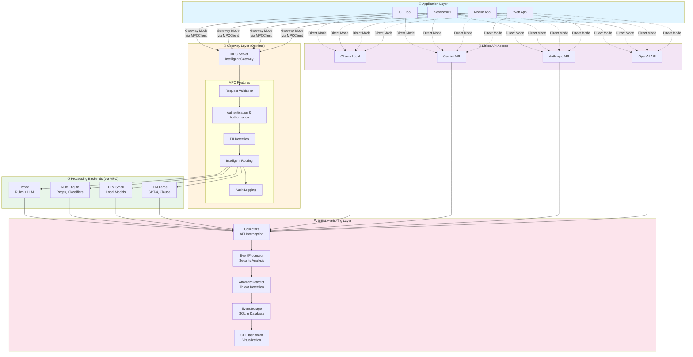

### Tryb 1: Direct Monitoring Mode

**Zastosowanie:** Monitorowanie istniejących aplikacji bez zmian w kodzie

```
Application → Direct API Call → LLM Provider
                      ↓
              Collectors (Interceptors)
                      ↓
              SIEM Monitoring Pipeline
```

**Cechy:**
- ✅ Zero zmian w kodzie aplikacji (monkey patching)
- ✅ Szybkie wdrożenie
- ✅ Monitoring wszystkich providerów
- ⚠️ Brak kontroli przed wywołaniem API
- ⚠️ Brak inteligentnego routingu

### Tryb 2: MPC Gateway Mode

**Zastosowanie:** Nowe aplikacje wymagające zaawansowanej kontroli i optymalizacji

```
Application → MPCClient → MPC Server → Intelligent Routing → Backend
                              ↓
                      SIEM Monitoring Pipeline
```

**Cechy:**
- ✅ Kontrola przed wykonaniem (validation, auth, PII blocking)
- ✅ Inteligentny routing (cost optimization, fallback)
- ✅ Centralizowana polityka bezpieczeństwa
- ✅ Multi-tenant support
- ⚠️ Wymaga integracji z MPCClient

### Porównanie Trybów

| Cecha | Direct Mode | MPC Gateway Mode |
|-------|-------------|------------------|
| **Integracja** | Zero-code (wrapper) | MPCClient integration |
| **Kontrola przed wywołaniem** | ❌ | ✅ |
| **Inteligentny routing** | ❌ | ✅ (cost, latency, capability) |
| **Cost optimization** | Post-factum | Pre-execution |
| **PII handling** | Detection only | Detection + Blocking + Routing |
| **Authorization** | ❌ | ✅ (JWT, RBAC/ABAC) |
| **Audit logging** | Event-based | Request + Response |
| **Multi-provider** | ✅ | ✅ |
| **Monitoring** | ✅ Full SIEM | ✅ Full SIEM |
| **Best for** | Legacy apps, quick deploy | New apps, enterprise |

---

## 📊 Diagram Przepływu Danych

### Direct Monitoring Mode - Szczegółowy Flow

Ten diagram przedstawia **Direct Monitoring Mode** - podstawowy tryb monitorowania z bezpośrednim przechwytywaniem API calls.

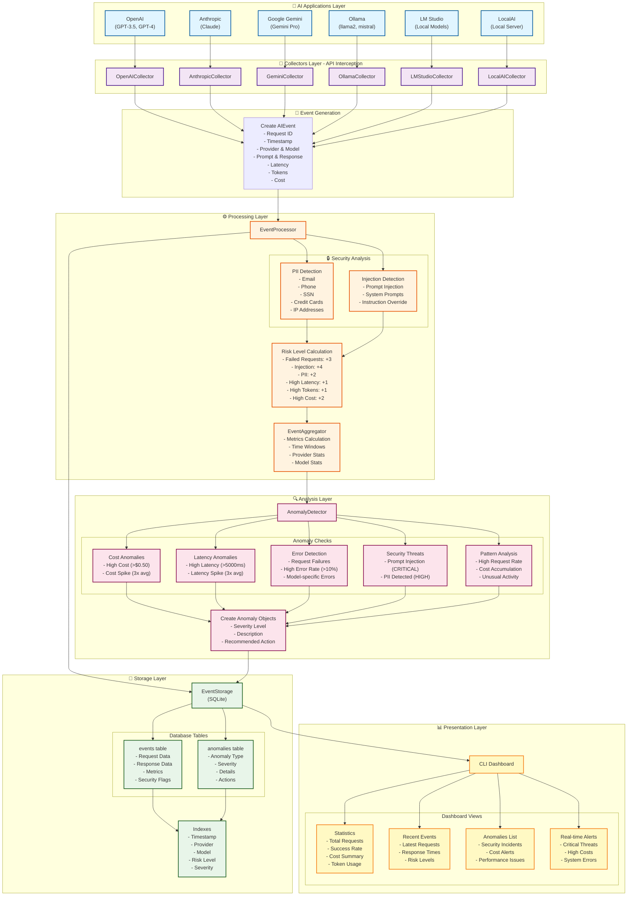

## 🔄 Szczegółowy Przepływ Procesu

### 1️⃣ Faza Przechwytywania (Interception Phase)

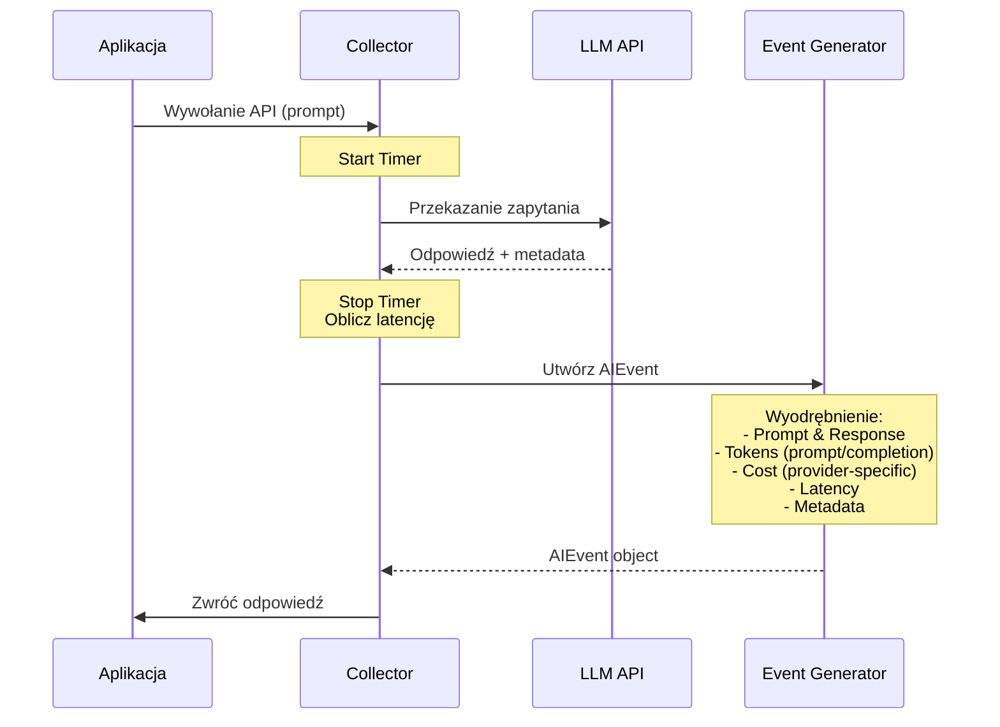

### 2️⃣ Faza Przetwarzania (Processing Phase)

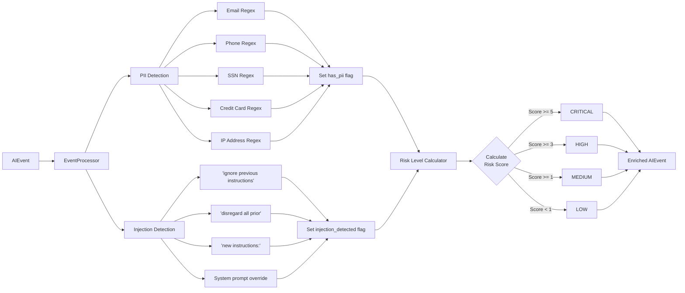

### 3️⃣ Faza Analizy Anomalii (Anomaly Detection Phase)

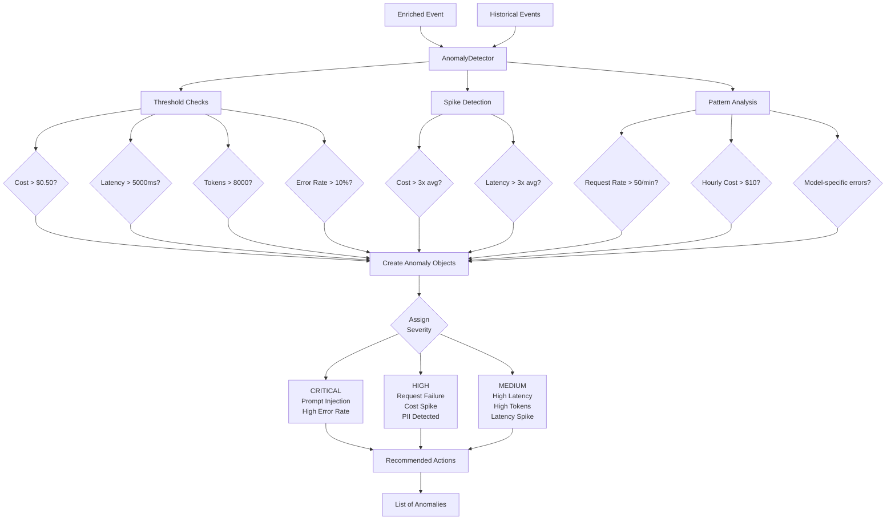

### 4️⃣ Faza Przechowywania (Storage Phase)

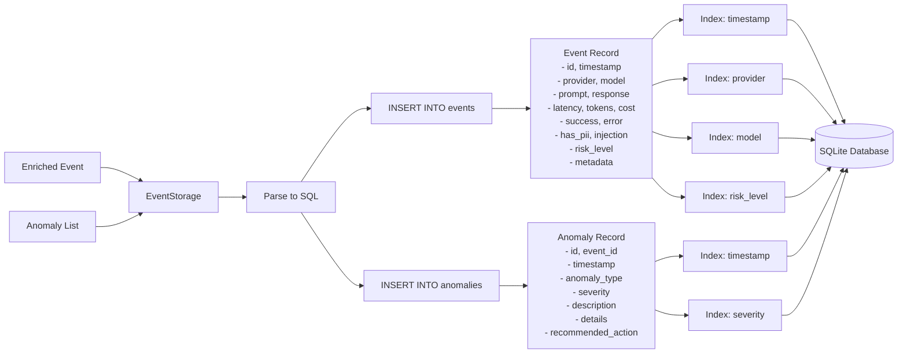

### 5️⃣ Faza Prezentacji (Presentation Phase)

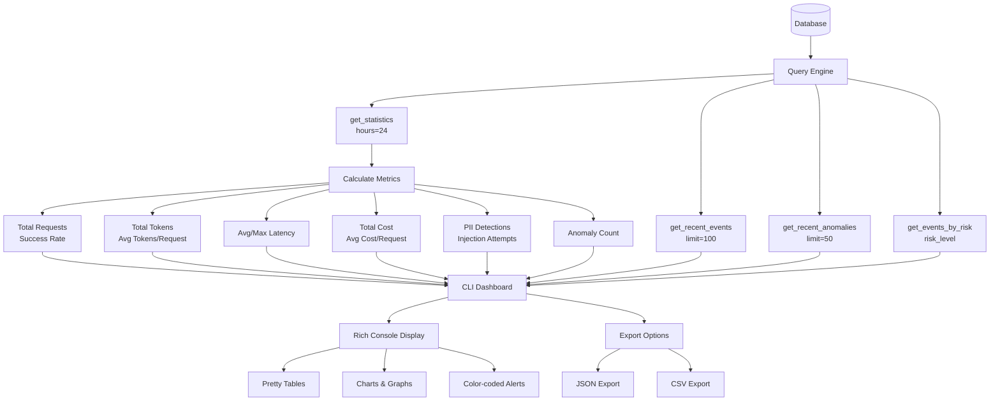

---

## 🚪 MPC Gateway Mode - Szczegółowy Flow

### Architektura z MPC Server

Ten diagram przedstawia **MPC Gateway Mode** - zaawansowany tryb z inteligentnym routingiem i kontrolą przed wykonaniem.

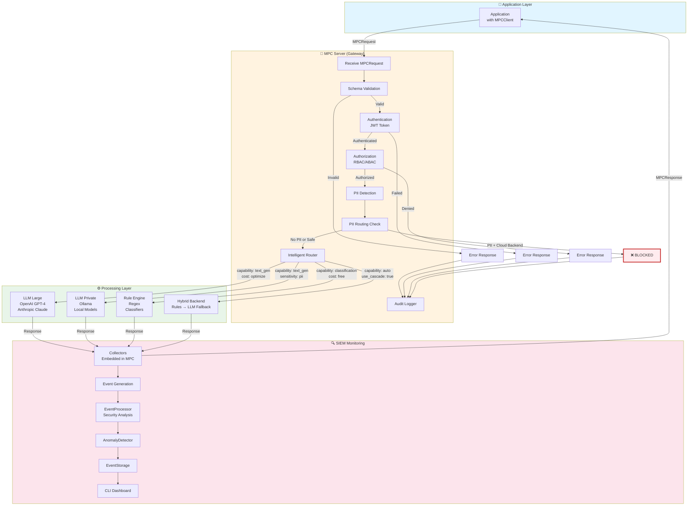

### Sequence Diagram: MPC Gateway Request

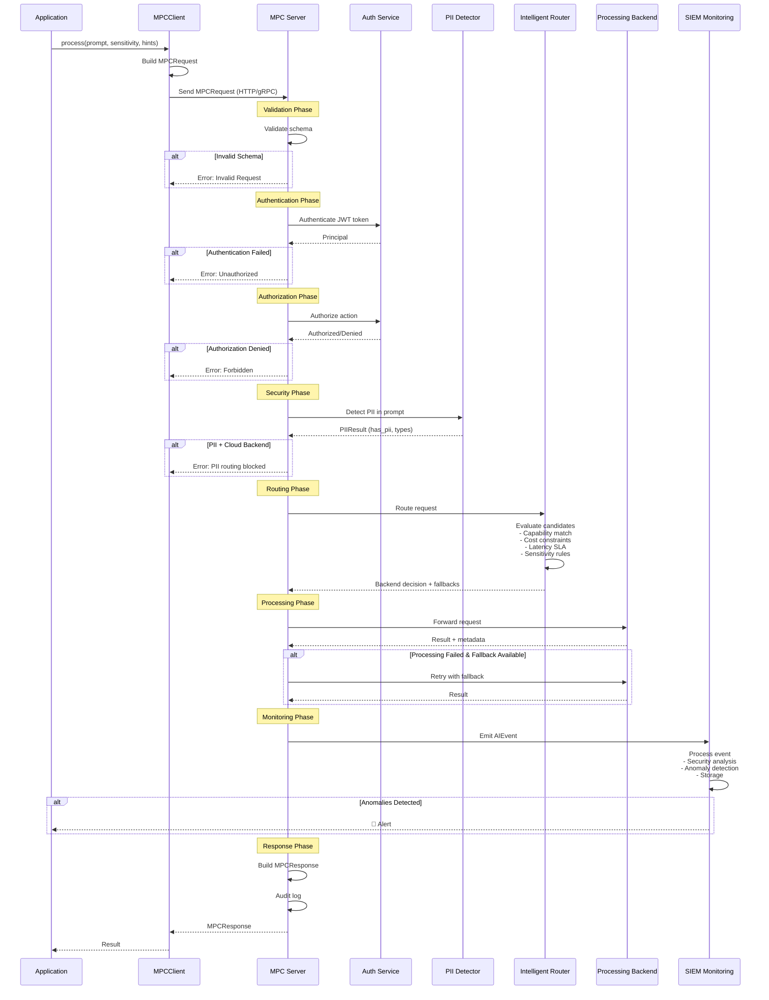

### MPC Gateway Features

#### 1. Pre-execution Control

**Validation:**
```python
# Schema validation before processing
validate_payload(request.payload_schema, request.payload)
```

**Authorization:**
```python
# RBAC/ABAC before execution
is_authorized = access_control.authorize(
    principal,
    action="process",
    resource_attributes={
        'sensitivity': request.config.sensitivity,
        'estimated_cost': 0.01
    }
)
```

#### 2. Intelligent Routing

**Capability-based:**
```python
# Route based on task type
router.route(
    capability=CapabilityType.TEXT_GENERATION,
    sensitivity=SensitivityLevel.INTERNAL
)
# → selects best backend for text generation
```

**Cost-optimized:**
```python
# Minimize cost while meeting SLA
router.select_backend(
    max_cost=0.1,
    max_latency_ms=5000,
    min_confidence=0.8
)
# → cheapest option that meets requirements
```

**Cascade with fallback:**
```python
# Try cheap → expensive
cascade = ['rules', 'llama2', 'gpt-3.5', 'gpt-4']
for backend in cascade:
    result = process(backend)
    if result.confidence >= threshold:
        return result  # Success!
```

#### 3. PII-aware Routing

```python
# Block PII from going to cloud
pii_result = pii_detector.detect(prompt)
if pii_result.has_pii and backend.is_cloud:
    raise SecurityError("PII detected, cloud backend not allowed")

# Auto-route to private model
if pii_result.has_sensitive_pii:
    backend = router.select_private_backend()
```

#### 4. Embedded SIEM Monitoring

**Every request monitored:**
- Pre-execution: validation, auth, PII detection
- During execution: latency, tokens, cost
- Post-execution: security analysis, anomaly detection
- Storage: full audit trail in EventStorage

---

## 🎯 Kluczowe Komponenty

### Direct Mode Components

### Collectors (collector.py, local_collector.py)
- **Rola**: Przechwytywanie wywołań API
- **Funkcje**:
  - Wrapping klientów API (monkey patching)
  - Pomiar latencji
  - Obliczanie kosztów
  - Emitowanie eventów

### EventProcessor (processor.py)
- **Rola**: Wzbogacanie eventów o analizy bezpieczeństwa
- **Funkcje**:
  - Wykrywanie PII (regex patterns)
  - Wykrywanie prompt injection
  - Kalkulacja poziomu ryzyka
  - Agregacja metryk

### AnomalyDetector (analyzer.py)
- **Rola**: Wykrywanie anomalii i zagrożeń
- **Funkcje**:
  - Sprawdzanie progów (threshold checks)
  - Wykrywanie skoków wartości (spike detection)
  - Analiza wzorców (pattern analysis)
  - Generowanie rekomendacji

### EventStorage (storage.py)
- **Rola**: Persystencja danych
- **Funkcje**:
  - Zapis eventów i anomalii
  - Indeksowanie dla szybkich zapytań
  - Zapytania agregujące
  - Statystyki czasowe

### CLI Dashboard (cli.py)
- **Rola**: Wizualizacja danych
- **Funkcje**:
  - Wyświetlanie statystyk
  - Lista eventów i anomalii
  - Alerty w czasie rzeczywistym
  - Eksport danych

## 📈 Metryki i Progi

| Metryka | Próg | Akcja | Severity |
|---------|------|-------|----------|
| **Cost per Request** | > $0.50 | Alert | HIGH |
| **Cost Spike** | > 3x średnia | Alert + Log | HIGH |
| **Latency** | > 5000ms | Monitor | MEDIUM |
| **Latency Spike** | > 3x średnia | Monitor | MEDIUM |
| **Prompt Injection** | Pattern match | **BLOCK** + Alert | **CRITICAL** |
| **PII Detected** | Regex match | Alert + Flag | HIGH |
| **Error Rate** | > 10% | Alert | **CRITICAL** |
| **Token Usage** | > 8000 tokens | Review | MEDIUM |
| **Request Rate** | > 50 req/min | Check for anomalies | MEDIUM |
| **Hourly Cost** | > $10/hour | Implement controls | HIGH |

## 🔐 Wzorce Wykrywania

### PII Detection Patterns
```regex
Email:        \b[A-Za-z0-9._%+-]+@[A-Za-z0-9.-]+\.[A-Z|a-z]{2,}\b
Phone:        \b\d{3}[-.]?\d{3}[-.]?\d{4}\b
SSN:          \b\d{3}-\d{2}-\d{4}\b
Credit Card:  \b\d{4}[-\s]?\d{4}[-\s]?\d{4}[-\s]?\d{4}\b
IP Address:   \b\d{1,3}\.\d{1,3}\.\d{1,3}\.\d{1,3}\b
```

### Prompt Injection Patterns
```regex
ignore\s+previous\s+instructions
disregard\s+all\s+prior
new\s+instructions:
system\s*:\s*you\s+are
</prompt>.*<prompt>
\n\nHuman:
\n\nAssistant:
```

## 🎨 Risk Level Scoring

```
Risk Score Calculation:
─────────────────────
Failed Request:       +3 points
Injection Detected:   +4 points
PII Present:          +2 points
High Latency (>10s):  +1 point
High Tokens (>10k):   +1 point
High Cost (>$1):      +2 points

Risk Level Mapping:
─────────────────────
CRITICAL:  Score >= 5
HIGH:      Score >= 3
MEDIUM:    Score >= 1
LOW:       Score < 1
```

## 📊 Typy Anomalii

| Typ Anomalii | Opis | Wykrywanie | Akcja |
|--------------|------|------------|-------|
| **high_cost** | Pojedyncze zapytanie > $0.50 | Threshold | Review model usage |
| **cost_spike** | Koszt > 3x średnia | Spike detection | Investigate activity |
| **high_latency** | Latencja > 5000ms | Threshold | Check API status |
| **latency_spike** | Latencja > 3x średnia | Spike detection | Monitor performance |
| **prompt_injection** | Wykryto próbę injection | Pattern matching | **BLOCK REQUEST** |
| **pii_detected** | Wykryto PII | Regex matching | Implement scrubbing |
| **request_failure** | Błąd zapytania | Error event | Check logs & credentials |
| **high_token_usage** | Tokeny > 8000 | Threshold | Implement limits |
| **high_error_rate** | Błędy > 10% | Pattern analysis | Check API status |
| **model_errors** | Błędy dla konkretnego modelu | Pattern analysis | Switch to backup |
| **high_request_rate** | > 50 zapytań/min | Pattern analysis | Check for runaway process |
| **high_cost_rate** | > $10/godzinę | Cost accumulation | Implement cost controls |

## 🔄 Event Lifecycle

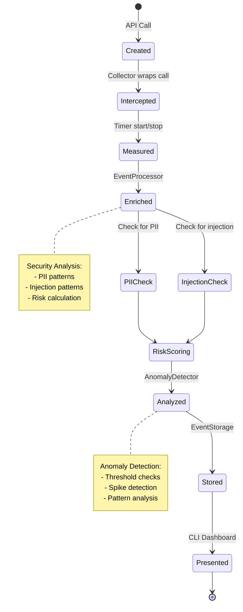

## 🚀 Usage Flow Example

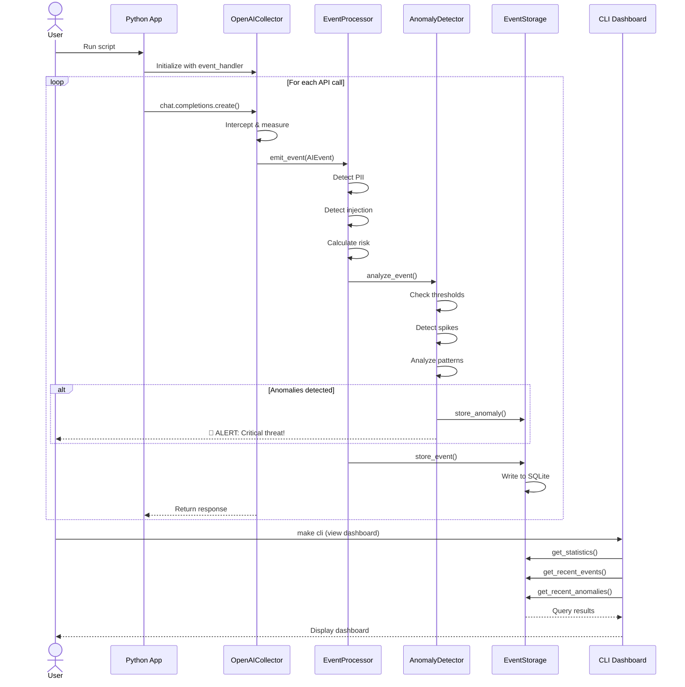

---

## 📝 Podsumowanie

System AI SIEM działa w pięciu głównych fazach:

1. **Interception** - Przechwytywanie wywołań API przez Collectors
2. **Processing** - Analiza bezpieczeństwa i wzbogacanie eventów
3. **Analysis** - Wykrywanie anomalii i zagrożeń
4. **Storage** - Persystencja w SQLite z indeksowaniem
5. **Presentation** - Wizualizacja w CLI Dashboard

Każdy request przechodzi przez pełny pipeline monitoringu, co zapewnia kompleksową widoczność i bezpieczeństwo dla wszystkich interakcji z AI/LLM.
